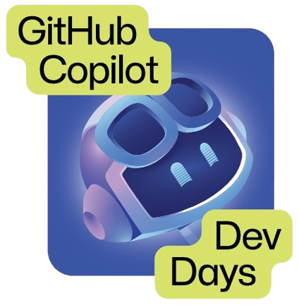

<div align="center">
  

# GitHub Copilot Dev Days
## Workshop: Agentic Workflows com `gh-aw`
</div>

---

Neste workshop você vai aprender a criar **workflows agênticos** com o GitHub Copilot usando a extensão `gh-aw` da GitHub CLI. Ao final, você terá um workflow automatizado rodando com agentes de IA (Claude e Codex).

> **Referências úteis**
> - [awesome-copilot](https://github.com/github/awesome-copilot) — coleção de recursos sobre GitHub Copilot
> - [GitHub Marketplace Models](https://github.com/marketplace/models) — explore os modelos disponíveis
> - [Documentação gh-aw](https://github.github.io/gh-aw/setup/creating-workflows/)

---

## Pré-requisitos

<div align="center">
  
</div>

Execute o script de setup abaixo para instalar todas as dependências necessárias automaticamente.

### PowerShell (Windows — Prompt / ISE)

Faça o download do script e execute:

```powershell
curl.exe -L `
  -o github-copilot-dev-days.ps1 `
  https://raw.githubusercontent.com/felipementel/GitHubCopilotDevDays-Curitiba-2026/refs/heads/main/setup/github-copilot-dev-days.ps1
```

```powershell
pwsh -ExecutionPolicy Bypass -File .\github-copilot-dev-days.ps1
```

### PowerShell Core (pwsh)

Se ainda não tiver o PowerShell Core instalado, baixe aqui:

```
https://github.com/PowerShell/PowerShell/releases/download/v7.6.1/PowerShell-7.6.1-win-x64.zip
```

Ou execute tudo em uma linha — baixa e executa o script diretamente:

```powershell
$scriptPath = Join-Path $env:TEMP "github-copilot-dev-days.ps1"; curl.exe -L -o $scriptPath "https://raw.githubusercontent.com/felipementel/GitHubCopilotDevDays-Curitiba-2026/refs/heads/main/setup/github-copilot-dev-days.ps1"; if ($LASTEXITCODE -eq 0) { pwsh -ExecutionPolicy Bypass -File $scriptPath }
```

> **Tema do terminal:** personalize seu terminal com os temas do [Oh My Posh](https://ohmyposh.dev/docs/themes).

---

### Instalar o Node.js com NVM

Verifique as versões disponíveis e instale a versão recomendada para o workshop:

```bash
# Listar versões disponíveis
nvm list available

# Instalar a versão recomendada
nvm install 24.13.0

# Ativar a versão instalada
nvm use 24.13.0

# Confirmar a versão ativa
nvm current
```

---

### Verificar instalações

Após rodar o script, confirme que tudo está correto:

```bash
git --version   # Deve exibir: git version 2.x.x
gh --version    # Deve exibir: gh version 2.x.x
gh auth status  # Deve exibir: ✓ Logged in to github.com
gh aw version   # Deve exibir a versão da extensão aw
node --version  # Deve exibir: v24.13.0
```

---

## Passo 1 — Habilitar os Coding Agents

<div align="center">
  
</div>

Acesse as configurações do GitHub Copilot e habilite os agentes de codificação:

🔗 [github.com/settings/copilot/coding_agent](https://github.com/settings/copilot/coding_agent)

Habilite:
- ✅ **Claude** coding agent
- ✅ **Codex** coding agent

> Esses agentes permitem que o Copilot execute tarefas de forma autônoma dentro dos seus repositórios.

---

## Passo 2 — Instalar a extensão `gh-aw`

<div align="center">
  
</div>

### Windows / qualquer plataforma via `gh extension`

```bash
gh extension install github/gh-aw
```

Para atualizar uma instalação existente:

```bash
gh extension upgrade aw
```

### Linux / macOS via script

```bash
curl -sL https://raw.githubusercontent.com/github/gh-aw/main/install-gh-aw.sh | bash
```

### Verificar instalação

```bash
gh aw version
```

---

## Passo 3 — Criar um Personal Access Token (PAT)

A extensão `gh-aw` precisa de um PAT para interagir com a API do Copilot.

Acesse: 🔗 [github.com/settings/personal-access-tokens/new](https://github.com/settings/personal-access-tokens/new)

Configure o token com:

| Configuração | Valor |
|---|---|
| **Resource owner** | Sua conta pessoal |
| **Repository access** | Public repositories |
| **Account permissions → Copilot Requests** | Read-only |

> Use **Classic PATs no formato fine-grained** (`github_pat_...`).

Utilize a chave `COPILOT_GITHUB_TOKEN`
---

## Passo 4 — Habilitar Issues no repositório

Os workflows agênticos utilizam **Issues** como ponto de entrada para as tarefas. Certifique-se de que Issues estão habilitadas no repositório onde o workflow será executado.

**Settings → Features → Issues** ✅

---

## Passo 4.1 — Habilitar GitHub Pages

Publique a documentação do workshop via GitHub Pages apontando para a pasta `/docs`.

1. Acesse **Settings → Pages** no seu repositório
2. Em **Source**, selecione **Deploy from a branch**
3. Escolha a branch **`main`** e a pasta **`/docs`**
4. Clique em **Save**

```
https://github.com/<seu-usuario>/<seu-repositorio>/settings/pages
```

> Após salvar, o GitHub Pages ficará disponível em `https://<seu-usuario>.github.io/<seu-repositorio>/` em alguns instantes.

---

## Passo 5 — Inicializar o workflow com `gh aw`

<div align="center">
  
</div>

Dentro do diretório do repositório, execute:

```bash
gh aw init
```

Este comando irá guiá-lo pela criação do arquivo de configuração do workflow agêntico.

> Para referência do formato do arquivo de workflow, consulte:
> 🔗 [raw.githubusercontent.com/github/gh-aw/main/create.md](https://raw.githubusercontent.com/github/gh-aw/main/create.md)

---

## Passo 6 — Compilar e validar o workflow

Após configurar o workflow, compile-o para validar a sintaxe e gerar os arquivos necessários:

```bash
gh aw compile
```

---

## Passo 7 — Configurar o agendamento (Cron)

Os workflows podem ser disparados por eventos ou por **agendamento via cron**.

Use o site [cron-checker.com](https://cron-checker.com) para validar suas expressões cron.

**Exemplo — a cada 10 minutos:**

```
*/10 * * * *
```

| Campo | Valor | Descrição |
|---|---|---|
| Minuto | `*/10` | A cada 10 minutos |
| Hora | `*` | Qualquer hora |
| Dia do mês | `*` | Qualquer dia |
| Mês | `*` | Qualquer mês |
| Dia da semana | `*` | Qualquer dia da semana |

---

## Recursos adicionais

| Recurso | Link |
|---|---|
| Documentação de workflows | [github.github.io/gh-aw/setup/creating-workflows/](https://github.github.io/gh-aw/setup/creating-workflows/) |
| Template de criação | [create.md](https://raw.githubusercontent.com/github/gh-aw/main/create.md) |
| awesome-copilot | [github/awesome-copilot](https://github.com/github/awesome-copilot) |
| GitHub Marketplace Models | [marketplace/models](https://github.com/marketplace/models) |

---

<div align="center">
  <sub>GitHub Copilot Dev Days — Workshop Agentic Workflows</sub>
</div>
